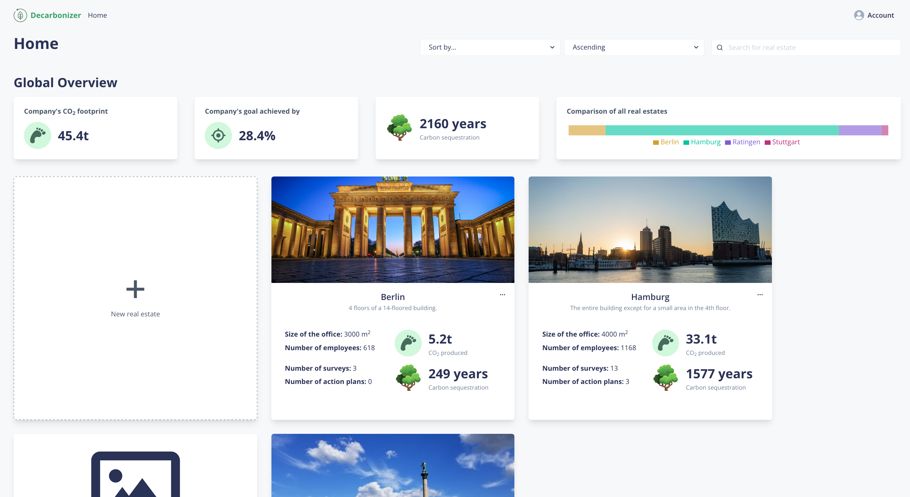
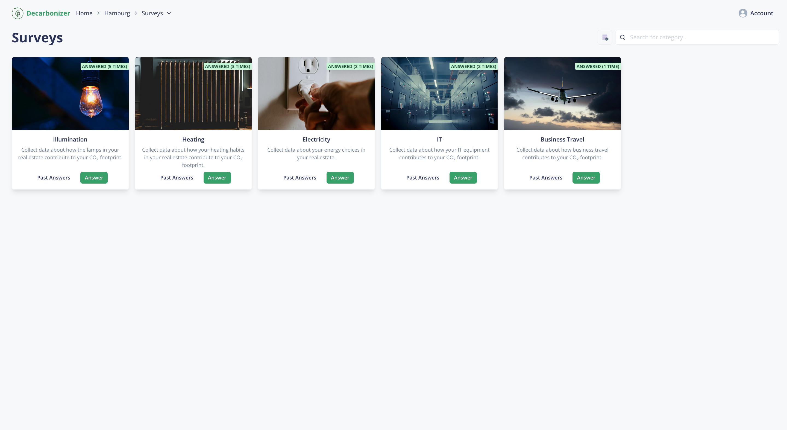
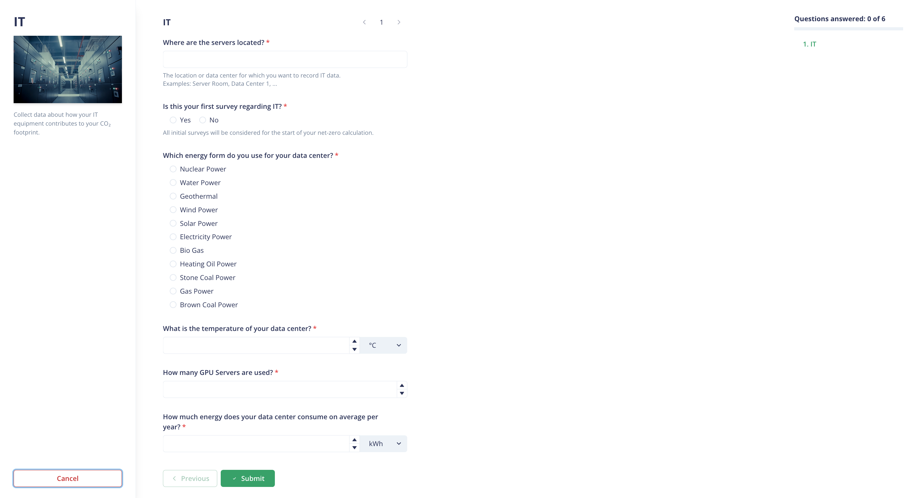
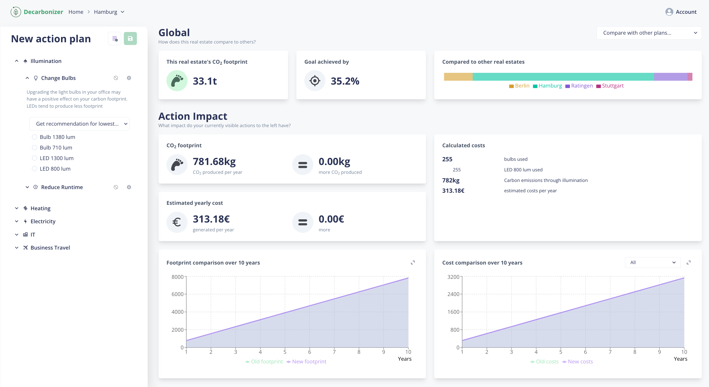
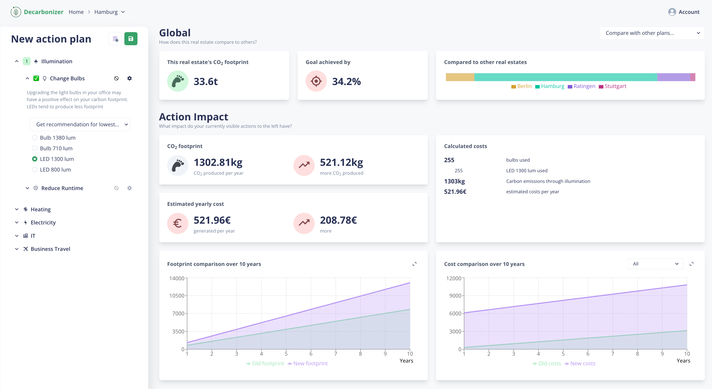
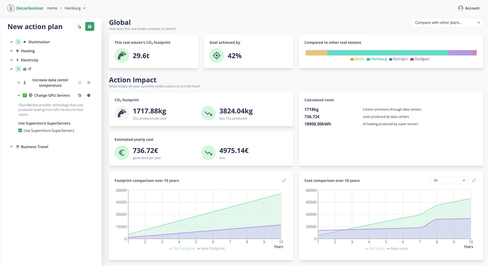
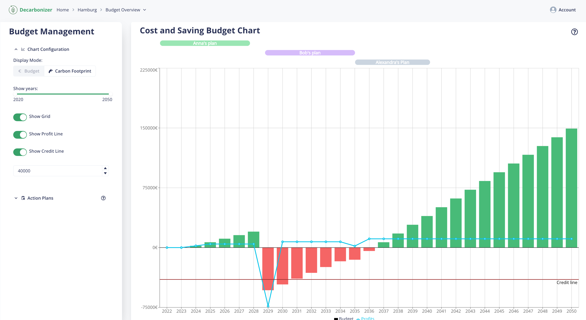

# Screenshot Tour

## Homepage

_Decarbonizer's home page. Here, you can see an overview with information about each of your company's
real estates. The real estates themselves can be managed here as well._

## Surveys

_Surveys are the location where you can provide Decarbonizer with data about a single real estate.
In the screenshot above, you can see an overview of all available surveys. In this example, all
surveys have been filled once or multiple times for "Hamburg"._

_As an example for a concrete survey, the image above shows the questionnaire that the "IT Survey"
asks. Each of the surveys asks different questions, some even spanning multiple pages to accurately
capture the company's initial carbon footprint situation._

## Action Plan Dashboard

_With all surveys being filled out, Decarbonizer can estimate the current carbon footprint and cost
situation for the respective real estate. This data is calculated accross the various categories
seen to the left._

_The depicted dashboard is conceptually bound to an "Action Plan". Users can take certain
actions in the panel to the left in order to reduce the carbon footprint. In the example above,
the user selected the "Change Bulbs" option with an inefficient bulb type. Using this bulb would
**increase** the carbon footprint and costs, as seen in the updated charts on the bottom._

_On the other hand, choosing an action which is **good** for the real estate will immediately
give you positive feedback via the charts._

## Buget Management

_With multiple action plans being created, Decarbonizer will also give users an overview about the
costs and/or profit generated by these over the years. This overview is called the "Budget Management".
Users can play around with the various action plans of a real estate here and immediately see the
impact on the finances._
